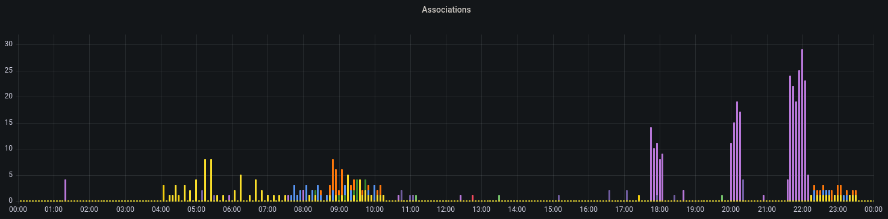

rfmon-to-influx
=================


*Successful Associations, grouped by AP within 24h*

<br>

Writing (mostly meta-) data received in Wireless-Monitor-Mode into an InfluxDB.

<br>

Table of contents
=================
<!-- TOC -->
- [1. Description](#1-description)
    - [1.1. What kind of data](#11-what-kind-of-data)
    - [1.2. Data-Usage](#12-data-usage)
    - [1.3. Tools used](#13-tools-used)
- [2. Usage/Installation](#2-usageinstallation)
    - [2.1. Prerequisites](#21-prerequisites)
    - [2.2. Running with Docker](#22-running-with-docker)
    - [2.3. Environment-Variables](#23-environment-variables)
- [3. Data collected](#3-data-collected)
    - [3.1. Data-Types](#31-data-types)
    - [3.2. Metric-Overview](#32-metric-overview)
    - [3.3. Metric-Details](#33-metric-details)
    - [3.4. Tag-Overview](#34-tag-overview)
    - [3.5. Tag-Details](#35-tag-details)
- [4. Potential Issues](#4-potential-issues)
    - [4.1. Channel/Frequency](#41-channelfrequency)
    - [4.2. Technology](#42-technology)
    - [4.3. Data protection](#43-data-protection)
    - [4.4. Ethical](#44-ethical)
<!-- /TOC -->
<br>

# 1. Description

This Program listens on an Wifi-Interface in Monitor-Mode (rfmon) and logs most actions made into an influx or influx-like time-database.

<br>

## 1.1. What kind of data

**Any** packet sent by a router or station nearby is received and its metadata is collected and categorised.

The host does **not** have to be part of that network.

<br>

## 1.2. Data-Usage

The data can be used to identify problems with the wifi-communication nearby
e.g.
- Wifi-Congestion at certain times of the day
- occurring signal-issues
    - e.g. due to broken Microwave-Ovens disrupting communications
    - or moving big Objects (e.g. Machines) causing signal-reduction.

<br>

Aswell as gaining knowledge about installed routers and user interaction with them
e.g.
- in a company environment
    - Logging presense and activity of interconnected machines
    - Finding other Access-Points not allowed due to potential disruption of Production-Lines

<br>

Other usages might be threat-detection at Wifi-Level
e.g.
- Deauthentication-Attacks
- Bruteforce-Attempts

<br>

## 1.3. Tools used

The program uses `tcpdump` for listening in a subProcess and then extract the metadata when packets arrive.


<br>

# 2. Usage/Installation

## 2.1. Prerequisites

The Wifi-Interface cannot be used elsewhere at the same time e.g. Network-Manager.
(Packet-capture e.g. tcpdump or Wireshark is ok)

As of this version, the program does **not** set the interface into monitor mode or changes to channels.

<br>

### 2.1.1. Interface into Monitor-Mode (rfmon)

You can change into Monitor-mode beforehand with the packages `net-tools` and `wireless-tools`:
```sh
ifconfig <interface> down
iwconfig <interface> mode Monitor
ifconfig <interface> up
```

<br>

### 2.1.2. Set/Change channels

You can set the channel of the interface (if the interface allows this) with the package `wireless-tools`:
```sh
iw dev <interface> set channel <channelNumber>
```

<br>

## 2.2. Running with Docker

### 2.2.1. Permissions

The container must run as **root**, to have permission to listen on the wifi-interface.

<br>

### 2.2.2. docker run

Either run with docker directly.

```sh
docker run
  -d
  --restart unless-stopped 
  --network host
  -e WIFI_INTERFACE="<yourInterfaceName or leave empty for wlan0>"
  -e INFLUX_URL="http://influxdb:8086/"
  -e INFLUX_TOKEN="<yourToken>"
  -e INFLUX_ORG="<yourOrganisation>"
  -e INFLUX_BUCKET="<yourBucket>"
  ruakij/rfmon-to-influx:2
```

<br>

### 2.2.3. docker-compose

Or use the more preferred way with docker-compose.

`docker-compose.yml`

```yaml
version: '3'

services:
  rfmon:
    container_name: rfmon
    image: ruakij/rfmon-to-influx:2
    restart: unless-stopped
    network_mode: "host"
    environment:
      - WIFI_INTERFACE="<yourInterfaceName or leave empty for wlan0>"
      - INFLUX_URL="http://influxdb:8086/"
      - INFLUX_TOKEN="<yourToken>"
      - INFLUX_ORG="<yourOrganisation>"
      - INFLUX_BUCKET="<yourBucket>"
```

And then pull&start the container:
```sh
docker-compose up -d
```

<br>

## 2.3. Environment-Variables

### 2.3.1. Necessary

Variable|Description
---|---
`INFLUX_URL`    | Url of influx-server
`INFLUX_TOKEN`  | Token with write-access
`INFLUX_ORG`    | Organisation and..
`INFLUX_BUCKET` | Bucket to write into

<br>

### 2.3.2. Optional

Variable|Default|Description
---|---|---
`LOGLEVEL`          | INFO              | Loglevel
`WIFI_INTERFACE`    | wlan0             | Token with write-access
~~`HOSTNAME`~~          | ~~Device's Hostname~~ | ~~Hostname to use as global hostname-tag~~ *(Unused)*

<br>

# 3. Data collected

8 Metrics are constructed with 6-10 tags identifying them.

<br>

## 3.1. Data-Types

Type|Example|Description
---|---|---
`String`    | Wlan | -
`Number`    | 0 | Any normal number, positive and negative
`Boolean`   | true | true or false values
`MAC`       | 12:34:56:78:9A:BC | Address for L2-networks

<br>

## 3.2. Metric-Overview
---
<br>

Name|Type|Description
---|---|---
rfmon_signal_dbm                | `Number` (-95 <> -20)   | Signal-Level of every Packet in dBm
rfmon_datarate_bytes            | `Number` (1 <> 144)     | Data-Rate of every Packet in MBit/s
rfmon_ssid_names                | `String` (Length: 0-32) | SSIDs of any Packet containing it
rfmon_authenticationtype_info   | `String`                | Authentication-Type used by Sender
rfmon_associationsuccess_bools  | `Boolean`               | Result of an Association
rfmon_disassociationreason_info | `String`                | Disconnect-Reason from a ST (not always sent)
rfmon_handshakestage_info       | `Number` (1 <> 4)       | Stage of a handshake (1 and 3 from ST, 2 and 4 from AP)

<br>

## 3.3. Metric-Details

### 3.3.1. rfmon_ssid_names
`String` (Length: 0-32)

SSIDs from ProbeRequest might be empty (probe for any) or in case of Beacon-Frames could be hidden.

### 3.3.2. rfmon_authenticationtype_info
`String` {OpenSystem_1, OpenSystem_2, Unknown}

<br>

## 3.4. Tag-Overview
---
<br>

Name                |Type                   |Description
---|---|---
srcmac              | `MAC`     | Sender's MAC-Address (not present in ClearToSend-Packet)
dstmac              | `MAC`     | Destination's MAC-Address (not present in RequestToSend-Packet)
bssid               | `MAC`     | AP's MAC-Address
frequency           | `Number`  | Frequency the packet was captured on in MHz
packetType          | `String`  | Type of packet
flags_MoreFragments | `Boolean` | Packet is incomplete
flags_Retry         | "         | Packet is being retried
flags_PwrMgt        | "         | Sender will not sleep
flags_MoreData      | "         | More data in send-buffer to be expected
flags_Protected     | "         | Packet is protected
flags_Order         | "         | Packet is strictly ordered

<br>

## 3.5. Tag-Details

### 3.5.1. frequency
`Number` (2412 <> 2484) 

The frequency corresponds to following wifi-channels:

Channel|Frequency
---|---
1   | 2412
2   | 2417
3   | 2422
4   | 2427
5   | 2432
6   | 2437
7   | 2442
8   | 2447
9   | 2452
10  | 2457
11  | 2462
12  | 2467
13  | 2472
14  | 2484

See [Wikipedia - List of WLAN channels - 2.4GHz](https://en.wikipedia.org/wiki/List_of_WLAN_channels#2.4_GHz_(802.11b/g/n/ax)) for more Information.

### 3.5.2. packettype
`String`

Type|Sender|Description
---|---|---
Beacon              | AP    | Signal its presence and provide synchronisation for Stations
ProbeRequest        | ST    | Ask if certain RA/SSID is available
ProbeResponse       | AP    | Directly respond to Request and Signal own presence
Data                | Both  | Data-packets
RequestToSend       | ST    | Ask for transmission-time
ClearToSend         | RA    | Ack transmission-time
Acknowledgment      | Both  | Ack Data-Packets
BlockAcknowledgment | Both  | Ack alot of Data-Packets at once
NoData              | Both  | Packet without content, typically used to transmit QoS-States
Authentication      | Both  | Authentication-process to establish identity and set states
AssociationRequest  | ST    | Register to AP
AssociationResponse | AP    | Respond to registering
Disassociation      | ST    | Actively unregister e.g. to associate with different AP
Handshake           | Both  | 4-Way-EAPOL-Handshake to generate encryption-keys between participants
Unknown             | -     | Unknown packets not identified into above types

<br>

# 4. Potential Issues

## 4.1. Channel/Frequency

The System can only monitor one channel at a time which might not be enough cover,
to combat this, more Interfaces and Systems can be deployed.

This is not entirely unproblematic, as the system cannot currently prevent packages from being inserted more than once.

<br>

## 4.2. Technology

Mismatches between sender and receiver-technologies (e.g. MIMO or HT) can cause packets not being logged at all.
Though this should only be a problem for data-packets.

<br>

## 4.3. Data protection

Because the system collects any data, this can be problematic, specially in countries with strong data-protection laws.

A wifi MAC address is likely to be considered as information of an identifiable natural person, e.g. under GDPR Art.4 (1) and its processing may only be done with prior consent or has to be anonymised.

<br>

## 4.4. Ethical

The large-scale collection of data for behavioural or movement analysis, especially without consent of the data subject, is highly controversial.

Metadata that can be used to track precise activities, such as wifi data, is very powerful and should only be collected and used when necessary.

If this data falls into the hands of a malicious actor, more precise attacks on the targets could be carried out, such as break-insv, behaviour-based discrimination or more successful phishing.
